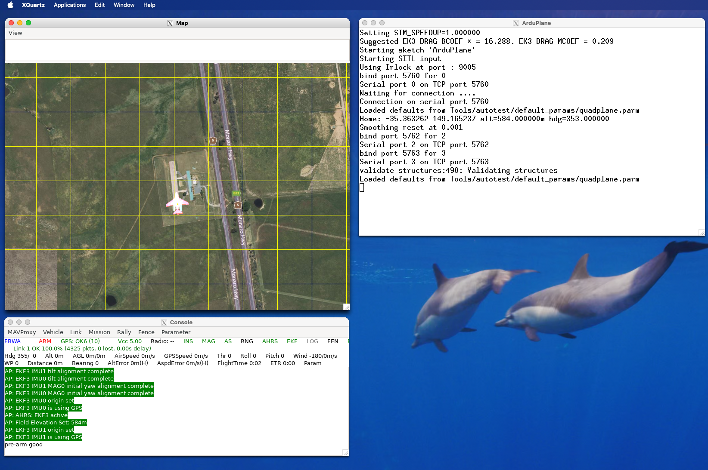

# Ardupilot SITL docker

Run Ardupilot SITL in Ubuntu LTS 22.04, forwarding the UIs to macOS using X11/XQuartz display



## Setup

- Install [docker desktop](https://www.docker.com/products/docker-desktop/)
- Clone repo: `git clone https://github.com/ben-xD/ardupilot-sitl-docker`
- Run `cd ardupilot-sitl-docker`
- Either:
  - Download and run the [images I publish](https://hub.docker.com/repository/docker/orthuk/ardupilot-sitl/general): `docker-compose -p sitl up -d remote`
  - Build a local image: `docker-compose -p sitl up -d local`

## Usage

- Depending on if you're using locally buit or remote image, use `sitl-remote-1` or `sitl-local-1` as the container name

- **1 command approach:** Run SITL command from outside container: `docker exec -it sitl-local-1 /home/docker/ardupilot/Tools/autotest/sim_vehicle.py -v ArduPlane --frame quadplane --map --console`
  - Run any command from outside container: run `docker exec -it sitl-local-1 $your_command`
- **Enter container approach:** Enter container: run `docker exec -it sitl-local-1 bash`
  - Once inside the container, start SITL: run `sim_vehicle.py -v ArduPlane --frame quadplane --map --console`

## To setup UI (MavProxy map, console and ArduPlane SITL) on macOS

- Install [Xquartz](https://www.xquartz.org/)
- Open Xquarts, go into preferences, Security, and enable  "Allow connections from network clients" (credits to https://stackoverflow.com/a/72593701/7365866)


- Restart your computer
- In your terminal, run `xhost + 127.0.0.1`. You need to re-run this whenever XQuartz is restarted
- Start SITL: run `docker exec -it sitl-local-1 /home/docker/ardupilot/Tools/autotest/sim_vehicle.py -v ArduPlane --frame quadplane --map --console`

## Avoiding running `zhost +` everytime

You could automatically run by adding the following to your `.zshrc`:
```bash
# See: 
# Allow docker containers to access X11/XQuartZ
xhost + 127.0.0.1 >/dev/null 2>&1
```

## Resources I used

- My experience writing Dockerfiles for a few years
- https://github.com/radarku/ardupilot-sitl-docker
  - I contributed some changes to it a few years ago (https://github.com/radarku/ardupilot-sitl-docker/commit/ee44adc4f6d57bbddaf911c102cb9ec40e79c683 and https://github.com/radarku/ardupilot-sitl-docker/commit/48cae9d88d8894dcbb6b805c19468a4bc1835877)
- https://ardupilot.org/dev/docs/building-setup-linux.html#building-setup-linux
- https://stackoverflow.com/questions/72586838/xquartz-cant-open-display-mac-os
- https://stackoverflow.com/questions/44429394/x11-forwarding-of-a-gui-app-running-in-docker

## Alternative approaches

You could consider adding ardupilot to the repo, and copying that in. That will allow you to make changes to Ardupilot and test them on a SITL conveniently.
